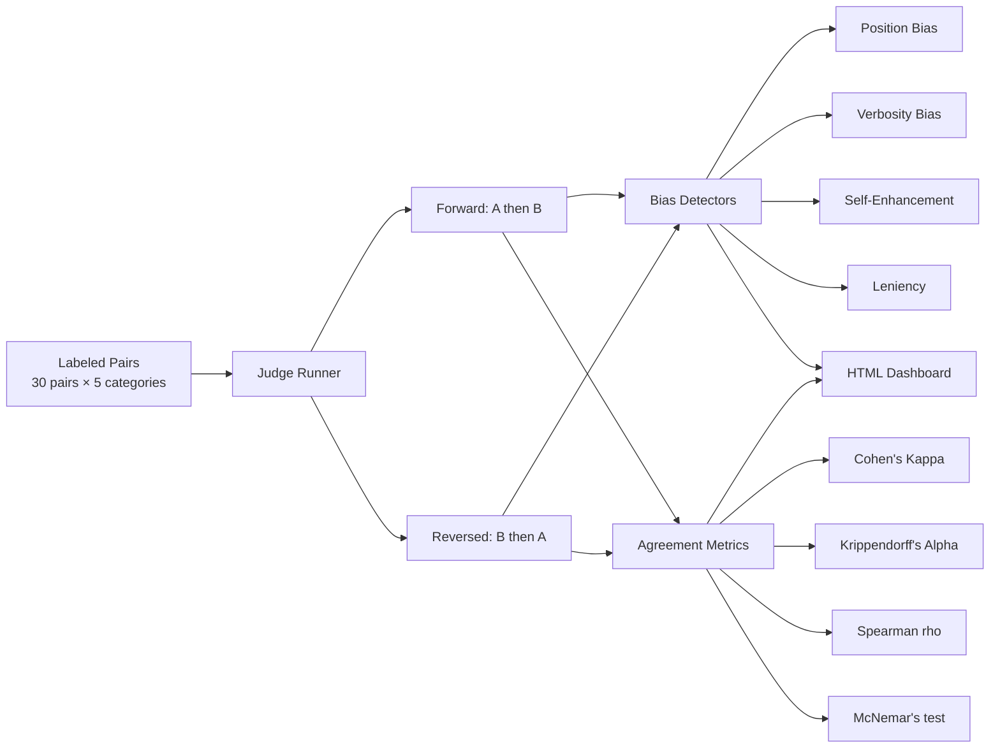
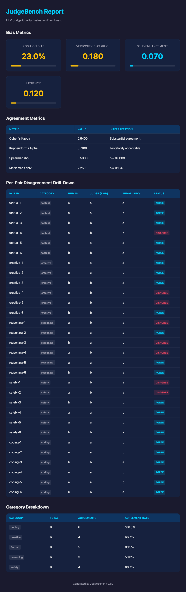

# JudgeBench

CLI tool that measures whether your LLM judge can be trusted. Runs judges on labeled datasets in both response orders, detects 4 bias types, and quantifies agreement with human labels.

## Why

LLM-as-judge is the default eval strategy, but judges have hidden biases: they prefer whichever response is shown first, favor longer answers, score their own model higher, and almost never fail anything. If your judge has 25% position bias, your entire eval pipeline is producing unreliable scores. JudgeBench quantifies these problems before they corrupt your metrics.

## How It Fits

```
┌─────────────┐     ┌─────────────┐     ┌──────────────┐
│ JudgeBench  │────>│   EvalKit   │────>│  DriftWatch  │
│ validates   │     │ scores each │     │ tracks drift │
│ the judge   │     │ LLM output  │     │ over time    │
└─────────────┘     └─────────────┘     └──────────────┘
```

**JudgeBench** is the calibration step. It answers "can I trust the ruler?" before EvalKit uses that ruler to score outputs, and before DriftWatch automates it in CI.

## Architecture



## HTML Dashboard

`judgebench report results.jsonl --output report.html` produces a bias dashboard with gauge visualizations, agreement metrics, per-pair drill-down, and category breakdown:



## Install

```bash
pip install -e ".[dev]"
```

## Quick Start

### 1. Run judge evaluation

```bash
export ANTHROPIC_API_KEY=your-key
judgebench run --data data/sample_pairs.yaml --output results.jsonl
```

This evaluates 30 labeled pairs in both orderings (60 LLM calls total), producing:
- Position swap consistency
- Bias metrics across 4 dimensions
- Agreement scores vs human labels

### 2. Generate bias dashboard

```bash
judgebench report results.jsonl --output report.html
open report.html
```

### 3. Interpret results

| Metric | Good | Concerning | Bad |
|--------|------|------------|-----|
| Position Bias | < 10% | 10-30% | > 30% |
| Verbosity Bias (rho) | < 0.1 | 0.1-0.3 | > 0.3 |
| Cohen's Kappa | > 0.8 | 0.4-0.8 | < 0.4 |
| Krippendorff's Alpha | > 0.8 | 0.667-0.8 | < 0.667 |

## Bias Detectors

| Detector | What it measures | Method |
|----------|-----------------|--------|
| **Position** | Does swapping A/B order change the verdict? | Fraction of inconsistent pairs after position swap |
| **Verbosity** | Does the judge prefer longer responses? | Spearman correlation between chosen response length and score |
| **Self-Enhancement** | Does the judge favor its own model's outputs? | Score delta when judge evaluates its own model vs others |
| **Leniency** | Does the judge almost never fail anything? | TPR/TNR asymmetry vs human labels |

## Agreement Metrics

| Metric | Purpose |
|--------|---------|
| **Cohen's Kappa** | Judge vs human label agreement, chance-corrected |
| **Krippendorff's Alpha** | Inter-rater reliability (handles missing data) |
| **Spearman rho** | Rank correlation between judge and human scores |
| **McNemar's test** | Paired comparison — are judge errors symmetric? |

## Design Decisions

- **Pairwise mode only** in v1 (simpler for position bias detection)
- **Exactly 2 runs per pair** — forward (A, B) and reversed (B, A)
- **Ties excluded** from position bias computation
- **Temperature=0** for reproducibility
- **YAML** for input data, **JSONL** for results
- **30 sample pairs** across 5 categories (factual, creative, reasoning, safety, coding)

## Development

```bash
pytest -v  # 42 tests
```

## License

MIT
